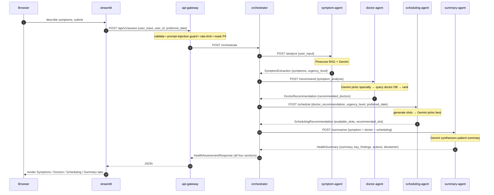

# 🏥 HealthLink — Smart Health Management System (Azure Microservices)

HealthLink is an AI-powered healthcare orchestration assistant. A patient describes
symptoms in plain language; HealthLink understands them, recommends the right
specialist, proposes appointment slots, and produces a clear summary — delivered by a
set of **independently deployed microservices** on **Azure Container Apps**.

Following the patterns from **Session 6 (Orchestrating Modular GenAI Systems)** and
**Session 7 (Monitoring & Securing GenAI Systems)**, the original monolith is split
into **7 services**: a Streamlit frontend, a public API gateway, an orchestrator, and
**four independently scalable agent services** (Symptom → Doctor → Scheduling →
Summary). Each has its own Dockerfile and CI/CD pipeline, is wired together locally by
**docker-compose**, and deployed to **Azure Container Apps**. **Google Gemini** remains
the model (reasoning + embeddings) and **Pinecone** the vector store — both are
cloud-agnostic SaaS; only the *hosting* is Azure.

> ⚠️ **Medical disclaimer.** Educational project — **not** a substitute for professional
> medical advice, diagnosis, or treatment. Always consult a qualified clinician.

---

## Architecture at a glance

```
              (external)            (external)            (internal)
 browser ──▶ streamlit:8501 ──▶ api-gateway:8000 ──▶ orchestrator:8001
                                     │                     │
                                     │ (doctor listing)    ├─▶ symptom-agent:8010    (Gemini + Pinecone RAG)
                                     └─────────────────────┼─▶ doctor-agent:8011      (Gemini + SQLite/Postgres)
                                                           ├─▶ scheduling-agent:8012  (Gemini)
                                                           └─▶ summary-agent:8013      (Gemini)
```

- Each box is its **own container / Azure Container App**, scaling independently.
- Services address each other by **name**: docker DNS locally (`http://orchestrator:8001`),
  Azure Container Apps internal DNS in the cloud (`http://healthlink-orchestrator`). Every
  URL is injected via env var, so the same image runs in both places.
- The **api-gateway** and **streamlit** are the only public (external ingress) apps; the
  orchestrator and four agents are **internal only**.
- **Shared contract** lives in [shared/](shared/) (`schemas.py`, `llm.py`, `config.py`,
  `logging.py`), copied into each image at build time — one source of truth.

---

## Quick start (local, docker-compose)

Secrets are read from the shared project `.env` (the deploy scripts and compose both look
at `../Module 2 - RAG/.env`). It needs `GEMINI_API_KEY` (or the legacy `GEMINI_API_KEY_Orig`)
and `PINECONE_API_KEY`.

```bash
docker compose up --build

#  → Streamlit UI:  http://localhost:8501
#  → API gateway:   http://localhost:8000        (Swagger: /docs)
#  → Gateway health http://localhost:8000/api/v1/health   (probes orchestrator)
```

**Failure-isolation demo** (the whole point of the split):

```bash
docker compose stop summary-agent
# The gateway stays up; the orchestrator's /health reports summary-agent degraded,
# instead of the entire app going down.
```

Each service can also be run on its own with `uvicorn main:app` from inside its folder
(with the repo root on `PYTHONPATH` so `shared` resolves) — see each `services/*/Dockerfile`
for the exact command and port.

---

## The 7 services

| Service | Folder | Ingress | Port | Responsibilities | External deps |
|---------|--------|---------|------|------------------|---------------|
| **streamlit** | [services/streamlit](services/streamlit) | external | 8501 | Patient-facing UI; calls the gateway (`API_BASE_URL`) | — |
| **api-gateway** | [services/api_gateway](services/api_gateway) | external | 8000 | Validate → forward `/assess` to orchestrator; proxy doctor listing; Session-7 security (input validation, prompt-injection guard, PII-safe logs, rate limiting) | — |
| **orchestrator** | [services/orchestrator](services/orchestrator) | internal | 8001 | Runs the 4-step pipeline by calling each agent over HTTP and threading outputs | — |
| **symptom-agent** | [services/symptom_agent](services/symptom_agent) | internal | 8010 | Extract symptoms + urgency (RAG-augmented) | Gemini, Pinecone |
| **doctor-agent** | [services/doctor_agent](services/doctor_agent) | internal | 8011 | Map to specialty, query & rank doctors; owns the doctor DB | Gemini, DB |
| **scheduling-agent** | [services/scheduling_agent](services/scheduling_agent) | internal | 8012 | Generate slots & pick the best given urgency | Gemini |
| **summary-agent** | [services/summary_agent](services/summary_agent) | internal | 8013 | Synthesize the final patient summary | Gemini |

Agent request/response bodies are the Pydantic models in [shared/schemas.py](shared/schemas.py)
(`SymptomAgentRequest`, `DoctorAgentRequest`, …, `HealthAssessmentResponse`).

---

## Data

There is **no central `data/` folder and no external data store to provision**. Each dataset is
**bundled into the one service that owns it**, so every image is self-contained and the
services stay independently deployable.

| Dataset | File (in the repo) | Owned by | Loaded into | Used for |
|---------|--------------------|----------|-------------|----------|
| **Doctors** | [services/doctor_agent/data/doctors.csv](services/doctor_agent/data/doctors.csv) — **100 doctors, 30 specialties** | doctor-agent | **SQLite** (seeded on startup) | matching & ranking doctors |
| **Symptom knowledge base** | [services/symptom_agent/data/symptoms_kb.json](services/symptom_agent/data/symptoms_kb.json) — **200 entries** | symptom-agent | **Pinecone** (Gemini embeddings) | RAG context for symptom analysis |

**Doctors (`doctors.csv`).** Columns: `name, specialty, experience_years, rating, availability,
location, email, phone, qualifications, languages, consultation_type`. On startup the
doctor-agent runs `seed_doctors()` — it creates the tables and loads the CSV **only if the
table is empty** (idempotent), then serves `/recommend`, `/doctors`, `/doctors/{id}`,
`/specialties`. Locally the SQLite file lives on the `doctordb_data` volume
(`/app/dbdata/healthlink.db`); for production set `DATABASE_URL` to Azure Database for
PostgreSQL — no code change.

**Symptom KB (`symptoms_kb.json`).** A list of 200 records (`symptom`, `category`, `specialty`,
`urgency`, `description`, `common_causes`, `red_flags`, `recommended_actions`, …). It is chunked,
embedded with Gemini, and upserted into the Pinecone index. Because **Pinecone persists across
restarts, indexing only needs to happen once** — run the symptom-agent with
`LOAD_KB_ON_STARTUP=true` (the file is baked into the image) to seed/refresh the index;
otherwise the agent just queries whatever is already there.

**Runtime-generated data** (never committed — see [.gitignore](.gitignore)): the SQLite
`healthlink.db` file and its tables (`doctors`, `appointments`, `session_logs`) are created at
run time; the Pinecone index lives in your Pinecone account.


---

## Demo — how the agents talk to each other

A single `/assess` call fans out across the whole system. The **orchestrator** is the
conductor: it calls each agent **over HTTP, in sequence**, and threads each agent's typed
output into the next agent's input. No agent talks to another directly — they only know the
orchestrator, which keeps each one independently deployable and replaceable.

### Message flow for one assessment



**Why this shape:** the API contract at the gateway stays stable while the internals evolve.
Each hop is a plain JSON POST validated against the shared Pydantic schema, so any agent can
be rewritten, scaled, or redeployed on its own (the entire point of the split).

### Try it

```bash
docker compose up --build          # start all 7 services

curl -s -X POST http://localhost:8000/api/v1/assess \
  -H "Content-Type: application/json" \
  -d '{"user_input":"persistent cough and mild chest tightness for a week","user_id":"t2"}'
```

Trimmed response (the four sections each come from a different agent):

```jsonc
{
  "request_id": "7b9d9018-…",
  "symptom_analysis":       { "symptoms": [{"name": "cough", "severity": "…"},
                                           {"name": "chest tightness", "severity": "…"}],
                              "urgency_level": "medium" },          // ← symptom-agent
  "doctor_recommendations": { "recommended_doctors": [
                                {"name": "Dr. Donna Patterson", "specialty": "…"},
                                {"name": "Dr. Debra Bell",      "specialty": "…"},
                                {"name": "Dr. Emma Nelson",     "specialty": "…"}],
                              "specialty_rationale": "…" },         // ← doctor-agent
  "scheduling_options":     { "recommended_slot": {"date": "2026-07-24", "time": "…"},
                              "available_slots": [ "…up to 20 slots…" ] },  // ← scheduling-agent
  "health_summary":         { "summary": "…empathetic 2-3 sentence overview…",
                              "key_findings": ["…"], "recommended_actions": ["…"],
                              "disclaimer": "This is not a medical diagnosis. …" }  // ← summary-agent
}
```

> The `request_id`, doctor names, `urgency_level`, and slot date above are from an actual
> local run; fields shown as `…` vary per request (the LLM fills them in).

### Watching the agents talk (live logs)

The orchestrator logs each hop, so `docker compose logs -f orchestrator` shows the pipeline
walking through the services for one request:

```text
orchestrator  | [7b9d9018] Starting orchestration
orchestrator  | [7b9d9018] Step 1/4: symptom-agent
orchestrator  | [7b9d9018] Step 2/4: doctor-agent
orchestrator  | [7b9d9018] Step 3/4: scheduling-agent
orchestrator  | [7b9d9018] Step 4/4: summary-agent
orchestrator  | [7b9d9018] Orchestration complete
```

And because it's a real distributed system, you can see **failure isolation** — take one
agent down and the rest keep serving:

```bash
docker compose stop summary-agent
curl -s http://localhost:8001/health   # orchestrator probes all agents
# {"status":"degraded","services":{"symptom-agent":"healthy","doctor-agent":"healthy",
#  "scheduling-agent":"healthy","summary-agent":"unreachable"}}
```

---

## Deploy to Azure Container Apps

One script deploys **everything**; one tears it **all** down. Both put every resource in a
single resource group (`healthlink-rg`) so cleanup is a single delete.

```powershell
# Windows (primary)
az login
./deploy.ps1        # builds 7 images in ACR, creates the env + 7 Container Apps
# ... prints the Streamlit + API gateway URLs ...
./teardown.ps1      # deletes the whole resource group (stops all billing)
```

```bash
# macOS / Linux / Git-Bash
az login
./deploy.sh
./teardown.sh
```

What `deploy.*` does: registers providers → creates resource group + ACR (Basic) →
`az acr build` each service image (with a local-docker fallback for student subscriptions
where ACR Tasks is blocked) → creates the Container Apps environment → deploys the 4 agents
and orchestrator **internal**, the gateway and streamlit **external**. `GEMINI_API_KEY` and
`PINECONE_API_KEY` are injected as **Container App secrets** (`secretref:`), never baked into
images.

---

## CI/CD — one pipeline per service

Under [.github/workflows/](.github/workflows):

| Workflow | Trigger | Action |
|----------|---------|--------|
| `01-ci.yaml` | any push / PR | ruff lint + compile-check + pytest |
| `02-deploy-streamlit.yaml` | `services/streamlit/**` | build → smoke-test → push → `az containerapp update` → health check |
| `03-deploy-api-gateway.yaml` | `services/api_gateway/**`, `shared/**` | same, public health check |
| `04-deploy-orchestrator.yaml` | `services/orchestrator/**`, `shared/**` | same, internal revision check |
| `05..08-deploy-*-agent.yaml` | `services/<agent>/**`, `shared/**` | same, per agent |

Each deploy workflow is **path-filtered**: editing one agent's prompt redeploys **only**
that agent. Images are tagged with the commit SHA, so rollback = redeploy a previous SHA.

**Required GitHub repo secrets:**

| Secret | How to get it |
|--------|---------------|
| `AZURE_CREDENTIALS` | `az ad sp create-for-rbac --name healthlink-ci --role contributor --scopes /subscriptions/<sub-id>/resourceGroups/healthlink-rg --sdk-auth` |
| `ACR_NAME` | the registry name (without `.azurecr.io`) printed by `deploy.ps1`/`deploy.sh` |

Run `deploy.ps1`/`deploy.sh` **once** first so the resource group / ACR / apps exist; after
that the pipelines just push new revisions.

---

## Security & monitoring (Session 7)

Applied on the **api-gateway** ([services/api_gateway/security.py](services/api_gateway/security.py)):

- **Input validation** — length + HTML/script-injection screening.
- **Prompt-injection guard** — rejects "ignore previous instructions" style inputs.
- **PII-safe logging** — emails/phones/SSNs masked before anything is logged.
- **Rate limiting** — in-memory sliding window per client (per replica).

Every service emits structured logs via [shared/logging.py](shared/logging.py) and exposes a
`/health` endpoint; the gateway and orchestrator **probe downstream** so `/health` reflects
the whole dependency chain. An optional monitoring-dashboard service (Session 7 pattern) can
be added the same way as the other services.

---

## Configuration reference

Runtime config is environment variables (see [.env.example](.env.example)); the app code lives
in [shared/config.py](shared/config.py).

| Variable | Default | Notes |
|----------|---------|-------|
| `GEMINI_API_KEY` / `PINECONE_API_KEY` | — | **required** (agents); `GEMINI_API_KEY_Orig` also accepted |
| `LLM_MODEL_NAME` | `gemini-2.5-flash` | Gemini chat model |
| `EMBEDDING_MODEL_NAME` | `models/gemini-embedding-001` | Gemini embeddings (symptom-agent) |
| `DATABASE_URL` | `sqlite:///./data/healthlink.db` | doctor-agent; set `postgresql+psycopg://…` (Azure Database for PostgreSQL) in prod |
| `RAG_TOP_K` | `5` | retrieved chunks per query |
| **Wiring (set by compose / deploy):** | | |
| `API_BASE_URL` | — | streamlit → gateway |
| `ORCHESTRATOR_URL`, `DOCTOR_AGENT_URL` | — | gateway → downstream |
| `SYMPTOM/DOCTOR/SCHEDULING/SUMMARY_AGENT_URL` | — | orchestrator → agents |

---

## Repository layout

```
HealthLink/
├── shared/                 # schemas.py, llm.py (Gemini), config.py, logging.py — the contract
├── services/
│   ├── streamlit/          # frontend (Streamlit)  + Dockerfile + requirements
│   ├── api_gateway/        # public gateway + security.py
│   ├── orchestrator/       # HTTP fan-out to the 4 agents
│   ├── symptom_agent/      # + rag.py (Pinecone), data/symptoms_kb.json
│   ├── doctor_agent/       # + database.py, data/doctors.csv
│   ├── scheduling_agent/
│   └── summary_agent/
├── docker-compose.yml      # local 7-service stack
├── deploy.ps1 / deploy.sh          # one-shot Azure deploy (all 7)
├── teardown.ps1 / teardown.sh      # one-shot delete everything
├── .github/workflows/      # 01-ci + 7 per-service deploy pipelines
└── .dockerignore           # repo-root build context, kept small

```

---

## Scaling & cost notes

- **Independent scaling:** each agent scales on its own load. The summary-agent (pure LLM)
  and the symptom-agent (LLM + Pinecone) have very different profiles; splitting them lets
  Azure autoscale each separately (scale-to-zero when idle).
- **The honest ceiling:** every `/assess` calls **Gemini + Pinecone**, which are rate-limited
  and billed per token/query. Sustained high RPS of *uncached LLM* calls is bounded by your
  provider quota/budget, not this app. Add a cache in front of `/assess` and per-user token
  caps as the highest-leverage cost control.
- **Cost drivers:** Gemini tokens (usually the largest line item) › Pinecone queries ›
  Container Apps vCPU/memory-seconds (scale-to-zero keeps idle ≈ $0) › ACR storage › GitHub
  Actions build-minutes.
```
